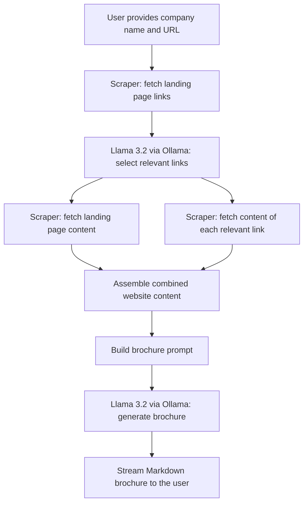

# Company Brochure Generator

## Overview

**Company Brochure Generator** is a small AI engineering project that automatically produces a professional company brochure from nothing more than a company name and a website URL.

It scrapes the target website, uses a locally-running **Llama 3.2** model (served via **Ollama**) to decide which pages are actually worth reading (About, Careers, Team, Products, etc.), scrapes those pages too, and then asks the model to synthesize everything into a clean Markdown brochure — streamed back to the user as it's generated.

This project is a refactored, production-style version of the `day5.ipynb` notebook from Week 1 of the `llm_engineering` course repository. All original behavior has been preserved; only the code organization has changed.

## Features

-  **Automatic web scraping** of a company's landing page and its internal links.
-  **LLM-based link triage** — Llama 3.2 reads the raw list of links on a page and decides which ones are relevant to a company brochure (About, Careers, Team, Products, Case Studies, Press, etc.), while ignoring noise (ToS, privacy policy, social links, anchors, duplicates).
-  **LLM-based brochure generation** — a second call to Llama 3.2 synthesizes all the scraped content into a concise, professional Markdown brochure.
-  **Streaming output** with a typewriter-style animation (via `IPython.display`) when run in a Jupyter environment.
-  **100% local & free** — runs entirely against a local Ollama server, so no paid API key is required and no website data leaves the machine.
-  **OpenAI-compatible client** — built on the standard `openai` Python SDK, pointed at Ollama's OpenAI-compatible endpoint, so swapping back to real OpenAI models is a one-line change (kept commented in the source for reference).

## Project Architecture

The pipeline uses two sequential LLM calls, sandwiched between scraping steps:

1. Scrape the company's landing page to get its raw list of links.
2. Ask Llama 3.2 to select which of those links are relevant to a brochure.
3. Scrape the content of the landing page and every relevant linked page.
4. Ask Llama 3.2 to turn all of that scraped content into a Markdown brochure.
5. Stream the result back to the user.

### Mermaid Workflow Diagram



## Project Structure

```text
company_brochure_project/
│
├── README.md
├── .gitignore
│
├── src/
│   ├── main.py        # Entry point: user interaction, orchestration
│   ├── scraper.py      # HTTP requests + BeautifulSoup HTML cleaning
│   ├── links.py         # LLM-based relevant-link selection
│   ├── brochure.py      # Content assembly + brochure generation/streaming
│   ├── llm.py            # Ollama / OpenAI-compatible client setup
│   ├── prompts.py         # All system and user prompts
│   └── utils.py            # Small shared helpers (truncation, JSON parsing)
│
└── assets/
    └── (optional screenshots)
```

## Requirements

- Python 3.12+
- [Ollama](https://ollama.com/) installed and running locally, with the `llama3.2` model pulled:

  ```bash
  ollama pull llama3.2
  ollama serve
  ```

- The Python dependencies already defined in the shared `llm_engineering` environment: `beautifulsoup4`, `requests`, `python-dotenv`, `openai`, `ipython`.

## Shared UV Environment

This project **does not** define its own `pyproject.toml`, `uv.lock`, `requirements.txt`, or `.venv`. It is designed to live inside the larger `llm_engineering` repository and use its **shared** UV-managed environment:

```text
llm_engineering/
│
├── pyproject.toml
├── uv.lock
├── .venv/
│
└── week1/
    └── company_brochure_project/
```

All dependencies (BeautifulSoup, requests, python-dotenv, openai, IPython, etc.) are expected to already be declared in the root-level `pyproject.toml` / `uv.lock` and installed into the shared `.venv`. Run everything from the activated shared environment.

## Installation

From the root of the `llm_engineering` repository:

```bash
# Sync the shared environment (only needs to be done once, at the repo root)
uv sync

# Activate the shared virtual environment
source .venv/bin/activate   # macOS / Linux
# .venv\Scripts\activate    # Windows
```

No further installation is required inside `week1/company_brochure_project/` itself.

## Running the Project

Make sure Ollama is running locally with `llama3.2` pulled, then, from the shared environment:

```bash
cd week1/company_brochure_project/src
python main.py
```

You will be prompted for:

1. The company name
2. The company website URL

The brochure will then stream to the console (and render as animated Markdown if run inside a Jupyter environment).

## Example Usage

```text
Enter the company name: HuggingFace
Enter the company website URL (e.g. https://example.com): https://huggingface.co

Generating brochure for 'HuggingFace' (https://huggingface.co) using local Llama 3.2 via Ollama...
Selecting relevant links for https://huggingface.co by calling llama3.2
Found 6 relevant links
```

## Example Output

```markdown
# HuggingFace

## Company Overview
HuggingFace is a platform and community building the tools that power the
future of machine learning...

## Products & Services
- Transformers library
- Model Hub
- Datasets Hub
- Spaces (ML app hosting)

## Careers
HuggingFace is actively hiring across engineering, research, and community roles...
```

*(Actual output will vary based on live website content and the local model's response.)*

## Ollama Configuration

The project talks to Ollama through its **OpenAI-compatible** endpoint:

- Base URL: `http://localhost:11434/v1`
- API key: `"ollama"` (a placeholder value — Ollama does not require real authentication)
- Model: `llama3.2`

This configuration lives entirely in `src/llm.py`. A commented-out block preserves the original paid-OpenAI configuration (`gpt-5-nano` / `gpt-4.1-mini` + `OPENAI_API_KEY`) for reference, in case a future contributor wants to switch back to a hosted model.

## Limitations

- Relies on the target website allowing scraping and not requiring JavaScript rendering (static HTML only — no headless browser).
- Link-relevance selection and brochure quality depend on the local `llama3.2` model's judgment and can vary between runs.
- Website content is truncated (2,000 characters per page, 5,000 characters for the full brochure prompt) to keep prompts within a reasonable size — very large or JS-heavy sites may lose relevant content.
- No retry logic for transient network failures beyond the individual link try/except in `fetch_page_and_all_relevant_links`.
- Streaming animation (`update_display`) only renders visually inside a Jupyter/IPython environment; a plain terminal run prints the final Markdown text instead.

## Design Decisions

- **Single-responsibility modules**: each file owns exactly one concern (scraping, prompts, LLM client, link selection, brochure assembly, entry point), mirroring the notebook's logical sections but making each piece independently testable and reusable.
- **Prompts centralized in `prompts.py`**: every system prompt and user-prompt builder lives in one place, so prompt engineering changes never require touching business logic.
- **`llm.py` owns only client setup**: the `MODEL` constant and Ollama/OpenAI client live together so switching providers or models is a one-line change.
- **No circular imports**: `scraper.py` has no project-internal dependencies; `prompts.py` depends only on `scraper.py`; `links.py` and `brochure.py` depend on `prompts.py`, `llm.py`, `scraper.py`, and `utils.py`; `main.py` depends only on `brochure.py`.

## Refactoring Decisions

- Extracted the shared 2,000/5,000-character truncation logic into `utils.truncate_text` instead of duplicating slice expressions.
- Extracted `json.loads(...)` into `utils.parse_json_response` so structured-LLM-response parsing has one consistent home.
- Split the original notebook's `get_brochure_user_prompt(company_name, url)` (which scraped internally) into two clear steps: `brochure.fetch_page_and_all_relevant_links` / `brochure.build_brochure_prompt` (assembly + truncation) and `prompts.get_brochure_user_prompt` (pure prompt text construction, no scraping) — keeping `prompts.py` free of any network calls, per the "no API calls" rule for that module.
- Added `requests` timeouts and `response.raise_for_status()` calls in `scraper.py` for more robust error surfacing, without changing the returned data shape.
- Renamed the `openai` client variable to `ollama_client` for clarity, since the OpenAI SDK is only used here as a generic OpenAI-compatible HTTP client for Ollama.
- Preserved every commented-out "OpenAI / GPT Version" code block from the original notebook (relabeled as reference comments) so the paid-API code path remains visible and easy to restore.

## Learning Objectives

- Using an LLM as a *classifier/router* (selecting relevant links) as one step in a larger multi-call pipeline.
- Chaining multiple LLM calls together to accomplish a task no single call could do well alone.
- Running open-weight models locally via Ollama through an OpenAI-compatible API, avoiding both API costs and external data exposure.
- Structured JSON output parsing from an LLM response.
- Streaming LLM responses for a better user experience.
- Refactoring exploratory notebook code into a maintainable, single-responsibility Python project.

## Future Improvements

- Add caching for scraped pages to avoid re-fetching the same URL across runs.
- Add unit tests (with mocked HTTP and LLM responses) for `scraper.py`, `links.py`, and `brochure.py`.
- Support headless-browser scraping (e.g. Playwright) for JavaScript-heavy sites.
- Allow the truncation limits and model name to be configured via environment variables.
- Add a simple CLI flag interface (e.g. `argparse`) as an alternative to interactive `input()` prompts.
- Export the generated brochure directly to a `.md` or `.pdf` file.

## License

This project is provided for educational purposes as part of the Week 1 exercises of the `llm_engineering` course repository. No explicit license is granted beyond that context; adapt as needed for your own learning.

## References

- [Ollama](https://ollama.com/)
- [Ollama OpenAI-compatible API docs](https://github.com/ollama/ollama/blob/main/docs/openai.md)
- [OpenAI Python SDK](https://github.com/openai/openai-python)
- [BeautifulSoup documentation](https://www.crummy.com/software/BeautifulSoup/bs4/doc/)
- [python-dotenv](https://pypi.org/project/python-dotenv/)
