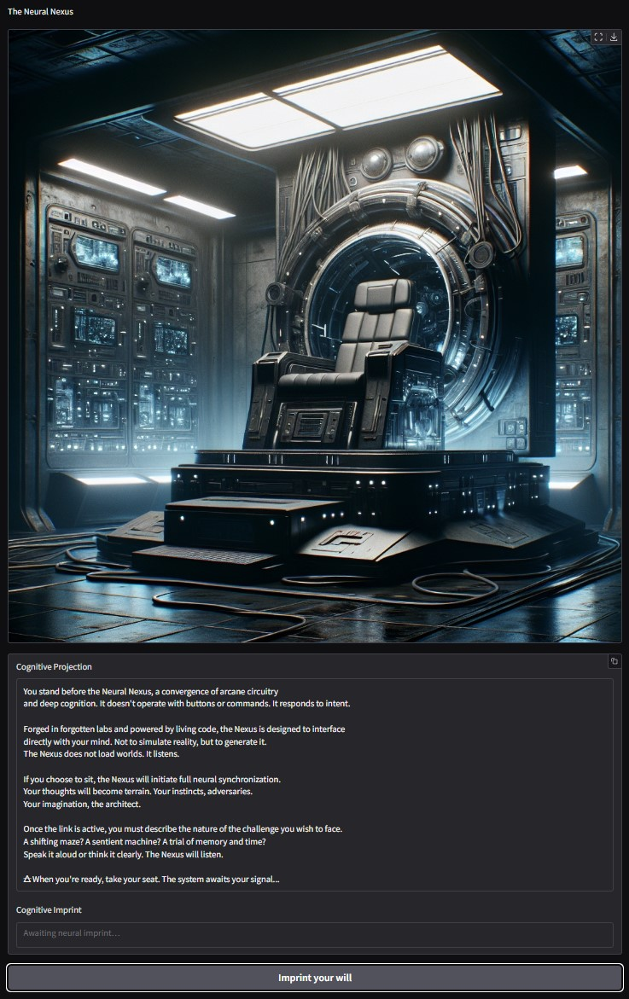
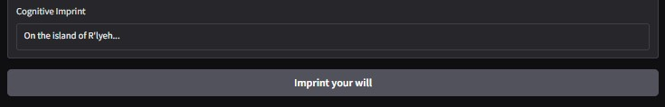
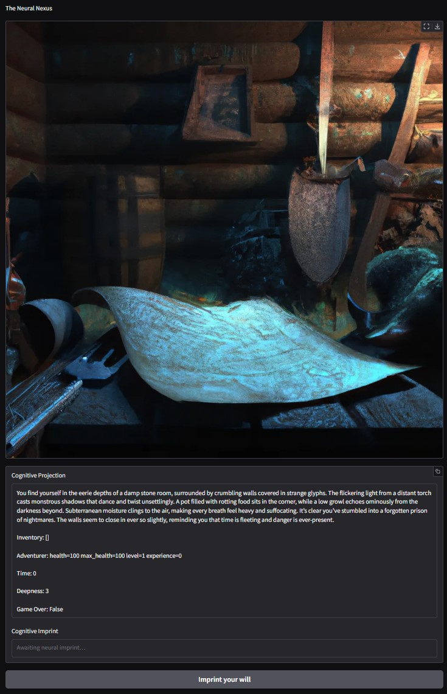
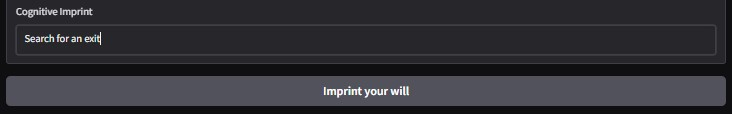
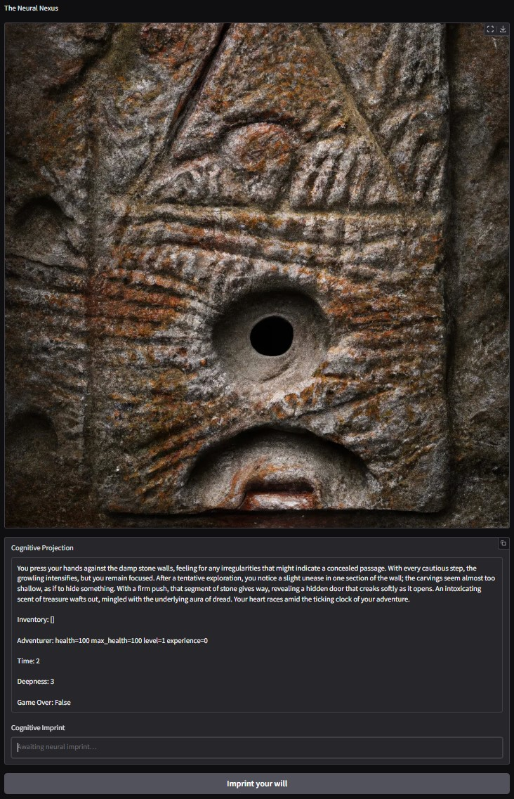
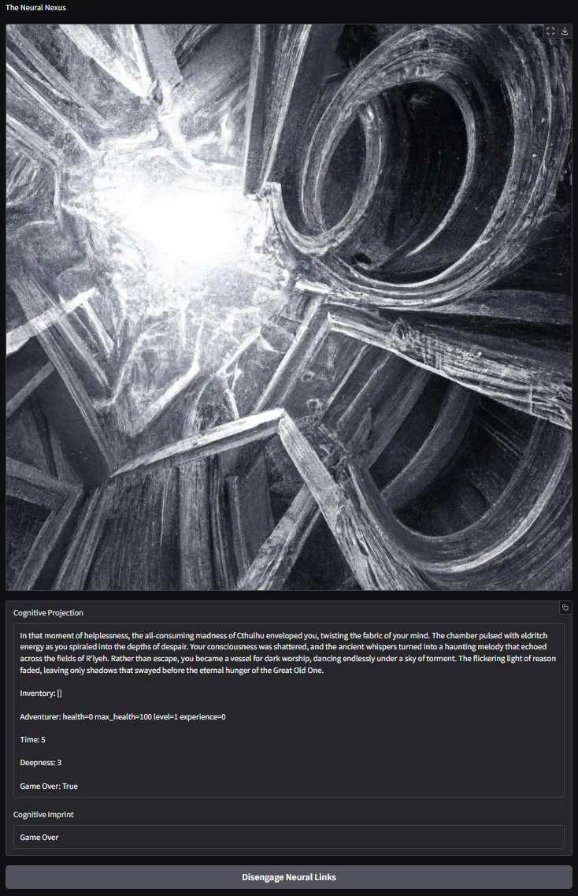

# The Neural Nexus

<!--  -->

TODO:

* Set boundaries to user inputs.
* Add sounds to the scene
* Add voice acting for the Game master's descriptions.
* Add voice input.
* Use video for the final scene: escape or death.
* Generate a score based on total treasures, exp gained and deep reached.

## Requirements

AI services access configuration:

* A `.env` file with the credentials required to access the different LLMs is required:

  * `OPENAI_API_KEY`: Required always as it's used by the *"storyteller"*.
  * `XAI_API_KEY`: Required if Grok's illustrator is used.
    *(Less prude, faster and portrait mode)*
  * `GOOGLE_API_KEY` Required if Gemini's illustrator is used.

  Obviously the used services must have been topped up with a small amount to generate
  the responses and the images.\
  *Refer to each service's current billing information.*

There are 6 variant implementations for the illustrator component, some of them may have
additional dependencies:

* `illustrator_dalle_2`: *(Set as default)*

  The Dall·E 2 implementation uses standard OpenAI client and should work out of the box.
  Although Dall·E has proven to be a bit prude and rejects to draw some combat scenes.

* `illustrator_dalle_3`:

  The Dall·E 3 implementation uses standard OpenAI client and should work out of the box.
  Although Dall·E has proven to be a bit prude and rejects to draw some combat scenes.
  This version gives noticeable better images than Dall·E 2 but at an increased cost

* `illustrator_grok`:

  The Grok 2 Image implementation uses standard OpenAI client and should work out of the
  box.
  It's faster but does not support quality or size controls.

  Images are generated in a *portrait mode*, so it fits specially well on mobiles.

  Grok is much less prude with violence and may draw combat scenes, at least against
  fantasy enemies, and blood.

* `illustrator_gpt`:

  The GPT Image illustrator uses standard OpenAI client, should work out of the box but
  it requires the user to be verified on OpenAI platform to have access to it.

* `illustrator_gemini`

  The Gemini illustrator uses the new Google SDK, `genai`, which replaces the old one
  used on the course, `generativeai`, this new one can be installed with:

  `python -m pip install google-genai`

  *Both `generativeai` and `genai` can be installed at the same time without problems*

* `illustrator_grok_x`

  The Grok_X illustrator uses the xAI SDK, `xai-sdk`, this can be installed with:

  `python -m pip install xai-sdk`

## Configuring the service and game

All services and game values can be set at `config.py` file.

Setting the `DRAW_FUNCTION` to `None` will disable the image generation and a fixed
image will be used.

## Game launch

The game can be launch from terminal, just navigate to game's root folder

* `cd community-contributions\dungeon_extraction_game`

and run the following command:

* `python -m game`\
  *Notice the `-m` is required due to the project's structure and import strategy.*

Game will take a few seconds to set up service and configure then logs will start to
show, among them the service address.

It will attempt to launch your default browser directly to the game's page.

The game can be stopped by hitting `ctrl + c` on the same terminal.

## Playing the game

Once on the browser the Starting screen will be shown:

There you should input the kind of game you want to play on the lower box and submit.

Your input can be as simple as a single word, like “spaceship”, or as detailed as you
like.

From that point on, only your imagination (and the Storyteller’s) will set the limits.

Once submitted, the image will update to reflect the scene, accompanied by a description,
your inventory, your adventurer’s status, and sometimes a few suggestions for what to do
next.

Although the game begins in English, if you switch to another language the Storyteller
understands, it will seamlessly continue in that language.

You’re free to type any action you want, the Storyteller will adapt.
Still, it’s instructed to keep the world coherent, so don’t expect to go completely off
the rails.

The game continues this way

Until you either escape with your treasures...
or meet your end.

The cling the bottom button to start over a new game.
