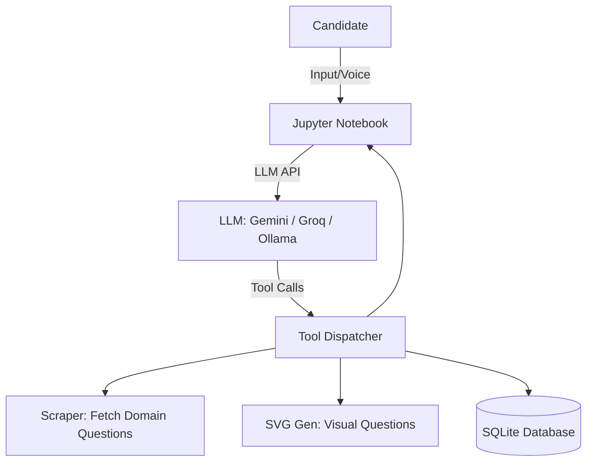

# Sentinel AI Interview Simulator

Welcome to the **Sentinel AI Interview Simulator** — an advanced, interactive, and intelligent platform designed to conduct mock technical interviews for AI and Machine Learning roles.

This project uses an agentic approach, orchestrating large language models (LLMs) to actively guide a candidate through a technical interview, evaluate their answers in real-time, generate dynamic visual questions, and persist performance metrics.

---

## 🎯 Features

*   **Multi-Model Orchestration:** Seamlessly integrates with multiple LLM backends (Gemini, Groq, and local Ollama) using an OpenAI-compatible function-calling structure.
*   **Domain-Specific Question Scraping (`scraper.py`):** Dynamically scrapes technical interview questions from predefined websites based on the candidate's chosen domain (AI or ML) to keep the interview content fresh and relevant.
*   **Deterministic SVG Generation (`svg_gen.py`):** Generates visual, analytical questions (e.g., bar charts, logic flowcharts, shape counting) using pure Python SVG templates. This avoids LLM hallucination for visual tasks while creating engaging, multimodal prompts.
*   **Real-time Scoring & Feedback (`tools.py`):** Actively scores candidate answers on a scale from 1 to 10 and generates constructive, actionable feedback.
*   **Persistent Analytics (`db.py`):** Automatically logs all sessions, questions, candidate answers, and final scores to a local SQLite database (`interview.db`) for post-interview review and progress tracking.
*   **Voice Integration:** Supports optional Text-to-Speech (TTS) capabilities to simulate a real conversational interview flow.

---

## 🏗️ Project Architecture



### Core Components

1.  **`sentinel_interview.ipynb`**: The interactive frontend where the user initiates the interview, answers questions, and views visual prompts.
2.  **`tools.py`**: The central tool dispatcher. It defines the OpenAI function-calling JSON schemas and maps LLM tool requests to local Python functions.
3.  **`db.py`**: Handles all SQLite data persistence. Logs session start/end times, individual question scores, and calculates session summaries.
4.  **`scraper.py`**: Uses `BeautifulSoup` to pull fresh questions from target URLs defined in the environment variables. Includes fallbacks if scraping fails.
5.  **`svg_gen.py`**: Creates purely deterministic SVG visual puzzles that are rendered directly in the notebook.
6.  **`patcher.py`**: A utility script used to configure and apply required patches to the notebook and tools (e.g., fixing model versions, prompt adjustments).

---

## 🚀 Getting Started

### Prerequisites

*   Python 3.10+
*   Jupyter Notebook
*   Required packages (can be installed via `requirements.txt`)

### Installation & Setup

1.  **Clone the Repository:**
    Navigate to your project folder and clone the repository.

2.  **Set up the Environment:**
    Create a `.env` file in the root directory and add your API keys and target URLs:
    ```env
    GEMINI_API_KEY=your_gemini_key_here
    GROQ_API_KEY=your_groq_key_here
    AI_QUESTIONS_URL=https://example.com/ai-questions
    ML_QUESTIONS_URL=https://example.com/ml-questions
    ```

3.  **Install Dependencies:**
    ```bash
    pip install -r requirements.txt
    ```

4.  **Run the Patcher:**
    To ensure the notebook is properly configured for your specific LLM model and prompts, run the utility patcher:
    ```bash
    python3 patcher.py
    ```

5.  **Initialize the Database:**
    The SQLite database will automatically initialize when the notebook is run, creating the required `sessions` and `questions` tables.

---

## 🎮 Usage

1.  Launch Jupyter Notebook:
    ```bash
    jupyter notebook
    ```
2.  Open `sentinel_interview.ipynb`.
3.  Select your preferred model provider (e.g., Gemini, Groq, or Ollama) within the notebook settings.
4.  Run the cells sequentially. When prompted, type "Hello, I am ready to begin my interview" and select your domain (AI or ML).
5.  Answer the technical questions and solve the visual SVG puzzles. The LLM will evaluate your responses automatically.

## 📊 Viewing Results

The AI agent will calculate your average score across the session. If you complete the interview or explicitly ask for your stats, the system will invoke `get_session_stats` to present your performance summary. You can also directly query the `interview.db` file for raw historical data.
