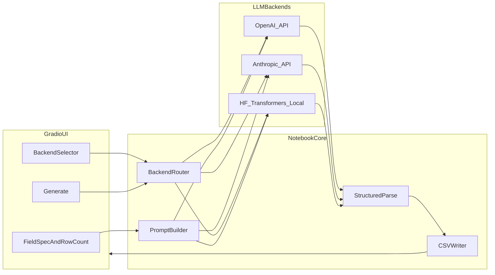

# Synthetic Data Generator — Implementation Plan

This document describes architecture, conventions, and operational details for the **Synthetic Data Generator** project. Implementation is **notebook-first** (`.ipynb`) under this directory so work can be opened in **Google Colab** from your GitHub fork.

## Goals

- Generate **synthetic tabular datasets** from user-defined **fields** and **row count**, using one of several **LLM backends**.
- **Gradio** UI for configuration, **preview**, and **CSV download**.
- **CSV only** in the first iteration; other formats are out of scope until explicitly added.
- **Colab Free** friendly: API backends need no GPU; local Hugging Face models should use **quantization** and modest context sizes (see `Week_3_Day_4_models.ipynb`).

## Code comments and readability

Implementation (notebooks and any `.py` helpers) should stay **easy to follow** without long essays. Aim for **light, purposeful** comments so a reader understands intent, contracts, and edge cases.

| Where | What to add |
|--------|-------------|
| **Notebook markdown cells** | Short section titles matching the cell map (install, secrets, backends, Gradio); one line on what the next code cell does if non-obvious. |
| **Code cells / blocks** | A one-line header comment when a cell does several steps (e.g. `# Load API clients and build MODEL_CONFIG from env.`). |
| **Functions** | A single **docstring** or leading comment: parameters, return value, and side effects (e.g. mutates global model, reads env). |
| **Classes / modules** | One class- or module-level docstring describing responsibility only if the abstraction is non-trivial. |
| **Branches and conditions** | Brief comment when the *why* is not obvious from code (e.g. `# Retry with smaller batch after JSON parse failure.`). |
| **`try` / `except` / guards** | Comment what failure mode you handle and what you do next (re-raise, retry, user message). Avoid empty `except`; log or surface errors in Gradio. |

**Avoid**: restating what the code literally says, changelog-style noise, or commenting every line. **Prefer**: clarifying non-obvious design choices, API quirks, Colab-only behavior, and anything another you (six months later) would need to recall quickly.

## Repository layout and workflow

| Topic | Choice |
|--------|--------|
| **Code folder** | `week3/community-contributions/suveerchaudhary/` |
| **Development branch** | `suveerchaudhary/week3-solution` |
| **Fork (push)** | `https://github.com/suveerchaudhary/llm_engineering.git` |
| **Upstream PR** | `https://github.com/ed-donner/llm_engineering` after local and CI checks pass |
| **Primary artifacts** | Jupyter notebooks ([`week3_synthetic_data_generator.ipynb`](week3_synthetic_data_generator.ipynb)); optional small `.py` helpers in the same folder if needed for tests or imports |

## Architecture overview



### Data flow

1. User describes **columns** (names + optional type or description) and **N** rows.
2. Notebook builds a **user prompt** asking the model for a **JSON array** of length `K` (batch size, e.g. 5–20), each element an object with keys matching the column names.
3. **Router** selects backend and calls the model (non-streaming is simpler for parsing; if streaming, accumulate full text before parse).
4. **Parser** strips markdown code fences if present, `json.loads`, validates keys, appends rows to an in-memory table.
5. Repeat batches until **N** rows or a **max batch / retry** limit; surface partial results and errors in Gradio.
6. **CSV export** uses stable header order (same as field list), UTF-8 encoding, and Python `csv` module or **pandas** `to_csv` with `index=False`.

## Reference notebooks in this repo

- **Multi-backend + Gradio**: [`week2/community-contributions/suveerchaudhary/week2_EXERCISE.ipynb`](../../../week2/community-contributions/suveerchaudhary/week2_EXERCISE.ipynb) — `MODEL_CONFIG`, `OpenAI` clients, `gr.Interface` / `gr.Blocks` patterns.
- **Local HF + GPU**: [`Week_3_Day_4_models.ipynb`](Week_3_Day_4_models.ipynb) — `AutoTokenizer`, `AutoModelForCausalLM`, `BitsAndBytesConfig`, `device_map="auto"`.

## Environment variables and secrets

Never commit API keys or Gradio passwords. Use **Colab secrets** (key icon) or a local `.env` (gitignored) with `python-dotenv`.

| Variable | Purpose |
|----------|---------|
| `OPENAI_API_KEY` | OpenAI API |
| `ANTHROPIC_API_KEY` | Anthropic (if using OpenAI-compatible endpoint as in week 2) |
| `HF_TOKEN` | `huggingface_hub.login` for gated models / higher rate limits |
| `GRADIO_USER` / `GRADIO_PASS` | Optional: read in notebook and pass to `launch(auth=(user, pass))` |
| `GRADIO_SHARE` or `SYNTHGEN_GRADIO_SHARE` | Optional: set to `true` / `1` / `yes` / `on` to force `launch(share=True)` on **Colab and local/Cursor** (public `gradio.live` link). If unset, `share` follows Colab vs local default. |
| `GOOGLE_API_KEY` | Only if you add Gemini via OpenAI-compatible URL (optional extension) |

In Colab, typical pattern:

```python
from google.colab import userdata
import os
os.environ["OPENAI_API_KEY"] = userdata.get("OPENAI_API_KEY")
```

Adjust secret names to match what you create in the Colab UI.

### Hugging Face Hub

For gated weights or smoother downloads:

```python
from huggingface_hub import login
login(token=os.environ["HF_TOKEN"])
```

### Gradio authentication

Use `gr.Blocks().launch(auth=(username, password))` or `auth` from env. Document the chosen username for collaborators; rotate passwords outside git.

## Backend matrix

| Backend | When to use | Colab GPU | Notes |
|---------|-------------|-----------|--------|
| **OpenAI** | Fast, reliable structured JSON | Not required | Use `response_format` / JSON mode where supported; validate output |
| **Anthropic** | High-quality text | Not required | Align with week 2 `base_url` pattern or native `anthropic` SDK |
| **HF local** | No per-token API cost; full control | Recommended | Small instruct model + 4-bit; watch RAM on T4 |

## Prompting and parsing

- Ask for **valid JSON only**: a single array of objects, keys exactly matching requested field names, no trailing commentary.
- **System message**: role-play as a synthetic data generator; forbid PII that matches real individuals; encourage diverse but plausible values.
- **Parser**: strip optional ` ```json ` fences; on failure, retry with a shorter batch or a “repair” prompt with the invalid snippet (cap retries).
- **Types**: if you encode types in the field spec, validate after parse (e.g. coerce integers, reject rows that cannot be coerced and optionally retry).

## CSV rules

- **Encoding**: UTF-8.
- **Header row**: first row; column order equals the user’s field order (or sorted lexicographically if you document that—pick one and stay consistent).
- **Quoting**: use `csv.QUOTE_MINIMAL` or pandas defaults; ensure embedded commas and newlines are escaped.
- **Preview**: show first 10–20 rows in `gr.Dataframe`; full file available as download.

## Suggested notebook cell map

Use markdown headings between cells for Colab readability.

1. **Title and runbook** — link to this plan, Colab open URL, branch name.
2. **Install** — `pip install` pinned versions as needed (`gradio`, `openai`, `transformers`, `accelerate`, `bitsandbytes`, `huggingface_hub`, `pandas`, `python-dotenv`, …).
3. **Imports and Colab secrets** — load env, optional `login()`.
4. **Config** — default models, batch size, max retries, `MODEL_CONFIG`-style dict.
5. **Prompt builders** — functions to build system + user messages from field spec and batch size.
6. **Backend callables** — one function per backend returning raw model text.
7. **Parse and accumulate** — JSON to list of dicts; merge batches.
8. **CSV helpers** — dict rows to CSV string or temp file path.
9. **Gradio `Blocks`** — inputs, generate handler, preview, file output, `launch(share=True)` optional for tunnels.
10. **Main guard** — if `__name__ == "__main__"` does not run in notebooks; instead last cell calls `demo.launch(...)`.

## Colab “Open in Colab” URL pattern

After you push the notebook to your fork on branch `suveerchaudhary/week3-solution`, use:

`https://colab.research.google.com/github/suveerchaudhary/llm_engineering/blob/suveerchaudhary/week3-solution/week3/community-contributions/suveerchaudhary/week3_synthetic_data_generator.ipynb`

Replace the notebook filename if yours differs. Colab clones from GitHub; you still add **secrets** in Colab for keys.

## Gradio UI sketch

| Component | Role |
|-----------|------|
| `gr.Textbox` (multiline) | Field definitions (one per line or structured text) |
| `gr.Number` | Target row count `N` |
| `gr.Dropdown` | Backend key (`gpt`, `claude`, `hf_local`, …) |
| `gr.Button` | Generate |
| `gr.Dataframe` | Preview |
| `gr.File` | Download generated CSV |
| `gr.Markdown` | Status / errors / token warnings |

Use `gr.Blocks()` for layout control and multiple outputs.

## Error handling policy

- **Missing API key**: clear message naming which backend needs which variable.
- **JSON parse failure**: bounded retries with smaller batch; show last raw snippet (truncated) in UI for debugging.
- **OOM on HF local**: catch CUDA OOM, suggest smaller model / smaller batch / restart runtime.
- **Partial dataset**: allow download of rows generated so far if user cancels (optional enhancement).

## CI/CD (GitHub Actions)

Workflows must live in **`.github/workflows/`** at the repository root.

Recommended workflow properties:

- **`on.push.branches`**: include `'suveerchaudhary/week3-solution'`.
- **`on.push.paths`** / **`pull_request.paths`**: `week3/community-contributions/suveerchaudhary/**`
- **Jobs**: install Python; `pip install nbformat`; small script or `jupyter nbconvert --validate` / read notebooks with `nbformat.read` to ensure valid JSON structure.
- **Avoid** default PR jobs that execute full notebooks with GPU or live API keys.
- **Optional**: `workflow_dispatch` for manual runs with repository secrets (document separately).

## Out of scope (v1)

- Non-CSV export formats.
- Automated deploy to Hugging Face Spaces (document only as stretch).
- Fine-tuning or training pipelines.

## Related checklist

See [`TODO.md`](TODO.md) for milestone checkboxes and ordering.
