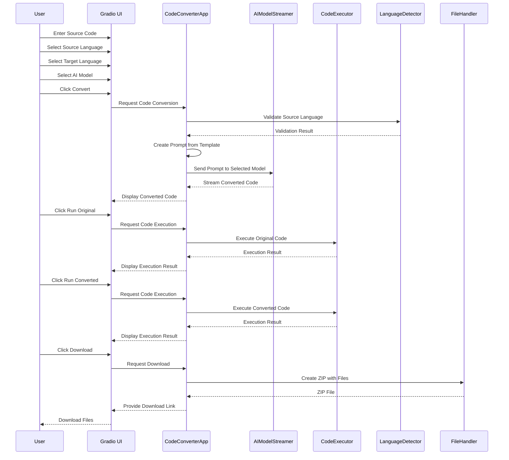
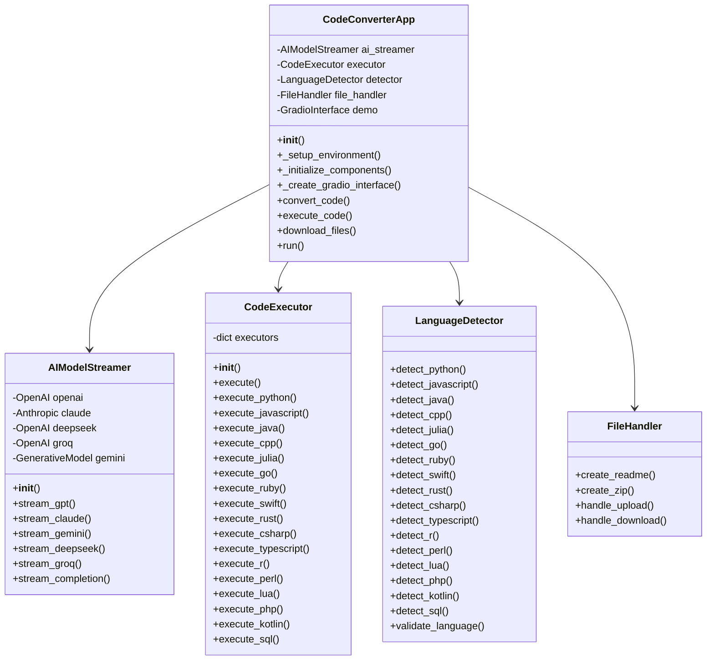

# Architecture Diagram

This diagram illustrates the architecture and component relationships of the CodeXchange AI application.

> **Note:** For detailed information about the CI/CD pipeline, see [CI/CD Pipeline Architecture](ci_cd_pipeline.md).

## Application Flow Diagram

```mermaid
graph TD
    %% Main Entry Points
    A[run.py] --> B[main.py]
    B --> C[CodeConverterApp]
    
    %% Core Components
    C --> D[Gradio UI]
    C --> E[AIModelStreamer]
    C --> F[CodeExecutor]
    C --> G[LanguageDetector]
    C --> H[FileHandler]
    
    %% AI Models
    E --> I[OpenAI GPT]
    E --> J[Anthropic Claude]
    E --> K[Google Gemini]
    E --> L[DeepSeek]
    E --> M[GROQ]
    
    %% Language Processing
    G --> N[Language Validation]
    F --> O[Code Execution]
    
    %% File Operations
    H --> P[File Upload/Download]
    H --> Q[ZIP Creation]
    
    %% Configuration
    R[config.py] --> C
    R --> E
    R --> F
    
    %% Template
    S[template.j2] --> C
    
    %% User Interactions
    D --> T[Code Input]
    D --> U[Language Selection]
    D --> V[Model Selection]
    D --> W[Code Conversion]
    D --> X[Code Execution]
    D --> Y[File Download]
    
    %% Logging
    Z[logger.py] --> C
    Z --> E
    Z --> F
    Z --> G
    Z --> H
    
    %% Styling
    style A fill:#f9d77e,stroke:#333,stroke-width:2px
    style B fill:#f9d77e,stroke:#333,stroke-width:2px
    style C fill:#f9d77e,stroke:#333,stroke-width:2px
    style D fill:#a8d5ba,stroke:#333,stroke-width:2px
    style E fill:#a8d5ba,stroke:#333,stroke-width:2px
    style F fill:#a8d5ba,stroke:#333,stroke-width:2px
    style G fill:#a8d5ba,stroke:#333,stroke-width:2px
    style H fill:#a8d5ba,stroke:#333,stroke-width:2px
    style I fill:#ffb6c1,stroke:#333,stroke-width:2px
    style J fill:#ffb6c1,stroke:#333,stroke-width:2px
    style K fill:#ffb6c1,stroke:#333,stroke-width:2px
    style L fill:#ffb6c1,stroke:#333,stroke-width:2px
    style M fill:#ffb6c1,stroke:#333,stroke-width:2px
    style R fill:#d0e0e3,stroke:#333,stroke-width:2px
    style S fill:#d0e0e3,stroke:#333,stroke-width:2px
    style Z fill:#d0e0e3,stroke:#333,stroke-width:2px
```

## Component Interaction Sequence

## Class Diagram

## Supported Languages and Models

```mermaid
graph LR
    subgraph "AI Models"
        M1[GPT]
        M2[Claude]
        M3[Gemini]
        M4[DeepSeek]
        M5[GROQ]
    end
    
    subgraph "Supported Languages"
        L1[Python]
        L2[JavaScript]
        L3[Java]
        L4[C++]
        L5[Julia]
        L6[Go]
        L7[Ruby]
        L8[Swift]
        L9[Rust]
        L10[C#]
        L11[TypeScript]
        L12[R]
        L13[Perl]
        L14[Lua]
        L15[PHP]
        L16[Kotlin]
        L17[SQL]
    end
    
    subgraph "Fully Implemented"
        L1
        L2
        L3
        L4
        L5
        L6
    end
    
    subgraph "Template Ready"
        L7
        L8
        L9
        L10
        L11
        L12
        L13
        L14
        L15
        L16
        L17
    end
    
    style M1 fill:#ffb6c1,stroke:#333,stroke-width:2px
    style M2 fill:#ffb6c1,stroke:#333,stroke-width:2px
    style M3 fill:#ffb6c1,stroke:#333,stroke-width:2px
    style M4 fill:#ffb6c1,stroke:#333,stroke-width:2px
    style M5 fill:#ffb6c1,stroke:#333,stroke-width:2px
    
    style L1 fill:#a8d5ba,stroke:#333,stroke-width:2px
    style L2 fill:#a8d5ba,stroke:#333,stroke-width:2px
    style L3 fill:#a8d5ba,stroke:#333,stroke-width:2px
    style L4 fill:#a8d5ba,stroke:#333,stroke-width:2px
    style L5 fill:#a8d5ba,stroke:#333,stroke-width:2px
    style L6 fill:#a8d5ba,stroke:#333,stroke-width:2px
    
    style L7 fill:#d0e0e3,stroke:#333,stroke-width:2px
    style L8 fill:#d0e0e3,stroke:#333,stroke-width:2px
    style L9 fill:#d0e0e3,stroke:#333,stroke-width:2px
    style L10 fill:#d0e0e3,stroke:#333,stroke-width:2px
    style L11 fill:#d0e0e3,stroke:#333,stroke-width:2px
    style L12 fill:#d0e0e3,stroke:#333,stroke-width:2px
    style L13 fill:#d0e0e3,stroke:#333,stroke-width:2px
    style L14 fill:#d0e0e3,stroke:#333,stroke-width:2px
    style L15 fill:#d0e0e3,stroke:#333,stroke-width:2px
    style L16 fill:#d0e0e3,stroke:#333,stroke-width:2px
    style L17 fill:#d0e0e3,stroke:#333,stroke-width:2px
```

