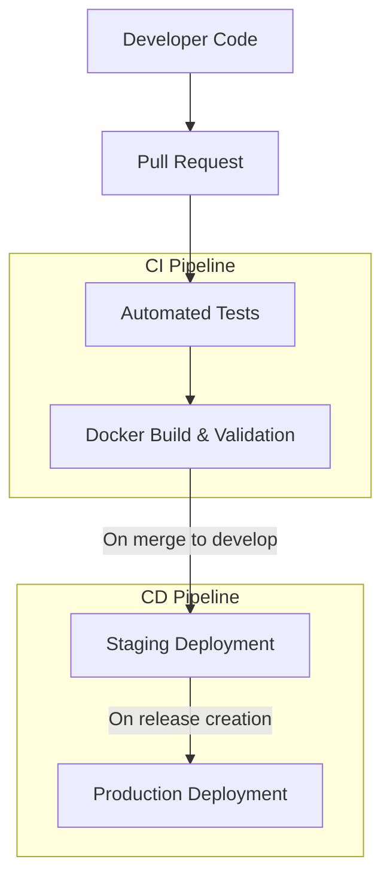

# CI/CD Pipeline Architecture

This document outlines the continuous integration and continuous deployment (CI/CD) pipeline implemented for CodeXchange AI.

## Pipeline Overview

The CI/CD pipeline automates testing, building, and deployment processes using GitHub Actions. It follows a trunk-based development model with protection for the main branch.

## Workflow Components

### 1. Python Testing Workflow

The testing workflow (`python-test.yml`) performs:
- Syntax validation and linting with flake8
- Unit and integration tests with pytest
- Code coverage analysis
- Matrix testing across Python 3.9, 3.10, and 3.11

### 2. Docker Build Workflow

The Docker workflow (`docker-build.yml`) performs:
- Dockerfile validation
- Container image building
- Security scanning with Trivy
- Vulnerability assessment

### 3. Staging Deployment

The staging workflow (`deploy-staging.yml`):
- Triggered on pushes to the develop branch
- Builds and tags Docker images with branch name and commit hash
- Pushes images to Docker Hub
- Deploys to the staging environment

### 4. Production Deployment

The production workflow (`deploy-production.yml`):
- Triggered on release publication
- Builds and tags Docker images with semantic version
- Pushes images to Docker Hub with version tags
- Deploys to the production environment with approval gate

## Security Considerations

- Sensitive credentials stored as GitHub Secrets
- Docker Hub authentication using access tokens, not passwords
- Security scanning for both code and container images
- Protected branches requiring CI checks to pass before merging

## Development Workflow

1. Create feature branch from develop
2. Implement changes with tests
3. Open pull request to develop
4. Pass all CI checks
5. Merge to develop (triggers staging deployment)
6. Create release for production deployment

## Required Repository Secrets

The following secrets must be configured in the GitHub repository:

| Secret Name | Purpose |
|-------------|---------|
| `DOCKERHUB_USERNAME` | Docker Hub username for image publishing |
| `DOCKERHUB_TOKEN` | Docker Hub authentication token |
