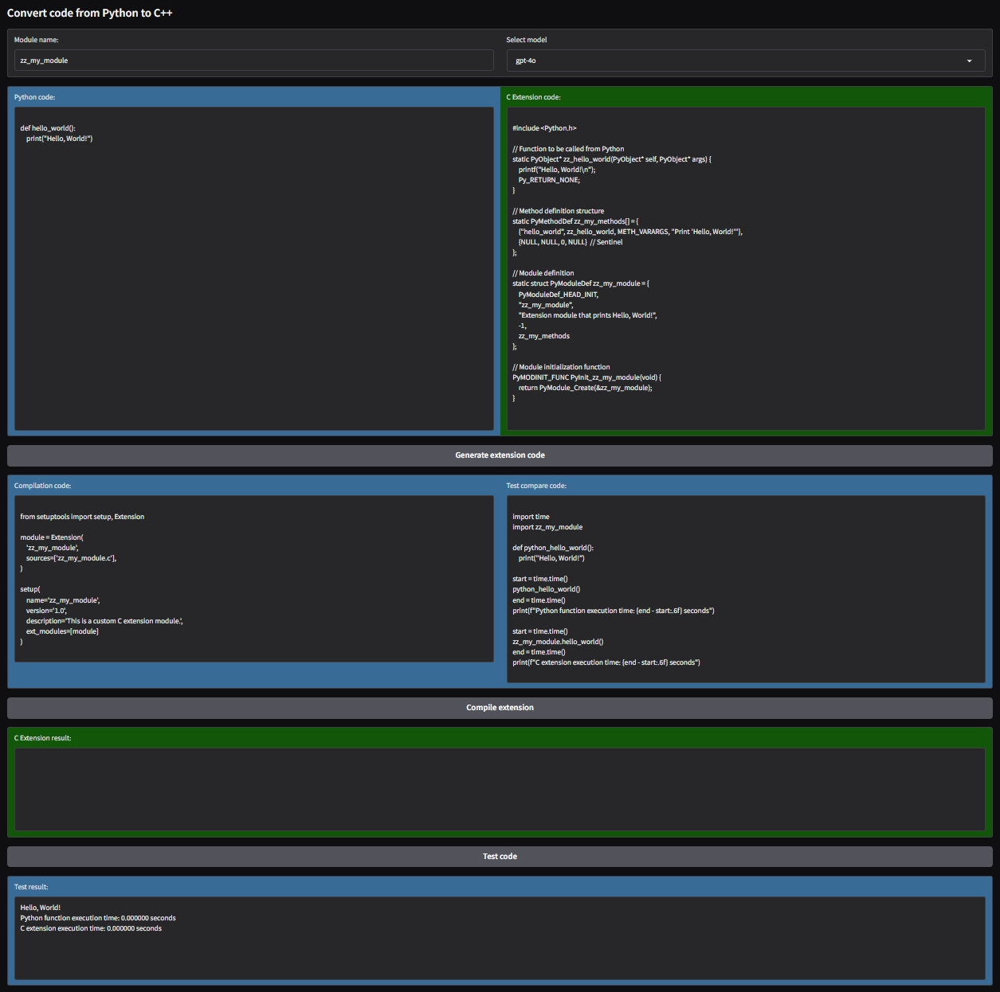

# Python C Extension code generator

Written by Carlos Bazaga [@carbaz] based on the work of Ed Donner [@ed-donner]
under the MIT License.

This folder contains a Jupyter notebook that demonstrates how to use a Frontier model
to generate high-performance Python C extension code from Python code.

The notebook includes examples of generating C extensions for calculating Pi using the
Leibniz formula and finding the maximum sub-array in an array.

Also, it includes a Gradio app that provides an interactive interface for users to input
Python code, generate C extension code, compile it, and test its performance against
the original Python code.

> [!CAUTION]
>
> **Always review the generated codes before running them, as they will be executed in
> your local environment and may contain code that could be harmful or unwanted.**
>
> AI-generated code may contain errors or unsafe practices, so it's crucial to
> thoroughly review and test any code before using it in a production environment.
>
> Never run code generated by AI models without understanding its implications and
> ensuring it adheres to your security and safety standards.

> [!IMPORTANT]
>
> **Disclaimer:** This notebook and the Gradio app are provided for educational purposes
> only. Use them at your own risk.

## Gradio app overview

In this image, you can see the Gradio app dashboard whose main sections are
described below.

\
*Image: Gradio app dashboard with default example `hello world` code loaded.*
*(compile output redacted for privacy)*

Sections:

* **Dropdown selectors and input fields**:
  * **Module name input**:
    A text input field where users can specify the name of the C extension module to be
    generated.

    That name will be used to create the C extension file `<module_name>.c` and
    the `setup.py` file required to compile the extension.

    That name will also be used to import the compiled module as usual in Python:

    ```python
    import <module_name>
    ```

    Or

    ```python
    from <module_name> import <function_name>
    ```

  * **Model selector**:
    A dropdown menu to select the Frontier model to use for code generation.

    Currently it includes:
    * `gpt-4o` (default)
    * `gpt-5`

* **Text input areas**:

  This areas are all editable, included those filled with generated code by the model.
  this allows users to modify and experiment with the code as needed.

  * **Python code**:
    A text area where users can input their Python code.
  * **C extension code**:
    A text area that displays the generated C extension code and allows to edit it.
  * **Compilation code**:
    A text area that shows the `setup.py` file generated,
    this file is required to compile the C extension.
  * **Test compare code**:
    A text area that provides example code to run the compiled C extension.

* **Output areas**:

  This are non-editable areas that display the results of various operations.

  * **C Extension result**:
    A text area that displays the output of the C extension code build.

    Beware that this area can contain a large amount of text including warnings during
    the compilation process and sensible information about the local environment,
    like: paths, Python version, etc may be included.

    Redact that information if you plan to share the output.

  * **Test result**:
    A text area that displays the output of the test code run.

* **Buttons**:
  * **Generate extension code**:
    A button that triggers the generation of the C extension code from the provided
    Python code.

    It will call the Frontier model to generate the C code, the setup.py file and
    the test code, filling the corresponding text areas automatically.

  * **Compile extension**:
    A button that compiles the generated C extension using the provided `setup.py` file.
    It will create the extension c file, `<module_name>.c` and the `setup.py` files in
    the local folder, then it will run the compilation command and build the C extension.

    > [!CAUTION]
    >
    > **Always review the `setup.py` code before running it, as it will be executed in
    > your local environment and may contain code that could be harmful or unwanted.**
    >
    > **Also review the generated C code, as it will be compiled and executed in your
    > local environment and may contain code that could be harmful or unwanted.**

    It will display the compilation output in the "C Extension result" area.

  * **Test code**:
    A button that executes the test code to compare the performance of the original
    Python code and the generated C extension.

    > [!CAUTION]
    >
    > **Always review the test code before running it, as it will be executed in
    > your local environment and may contain code that could be harmful or unwanted.**

    Will save the test code provided in the "Test compare code" into the
    `usage_example.py` file and execute it showing the output in the "Test result" area.
