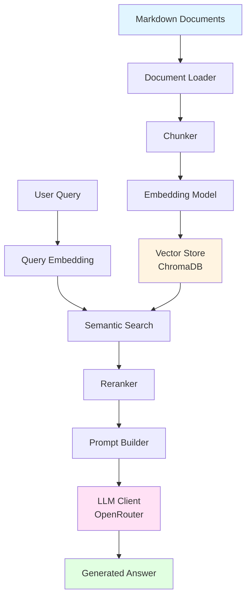

# Week 5: Company RAG Expert

**Week 5 Community Contribution - RAG System Implementation**

This document describes a Retrieval-Augmented Generation (RAG) system implemented as part of the Week 5 community contributions. The system processes markdown documents, generates embeddings, and provides question-answering capabilities using LLMs. The complete source code is available in the [GitHub repository](https://github.com/habeneyasu/company-rag-expert).

## Overview

This project implements a RAG system that processes markdown documents and enables question-answering over a knowledge base. The implementation includes document ingestion, embedding generation using sentence transformers, vector storage with ChromaDB, semantic search with optional reranking, and answer generation via OpenRouter. The system demonstrates modular architecture patterns learned during the Andela AI Engineering bootcamp.

## Technical Approach

The implementation follows a modular RAG pipeline design:

- **Local Processing**: Document processing, embedding generation, and vector storage occur locally
- **Modular Architecture**: Separation of concerns across ingestion, storage, retrieval, and generation layers
- **Metadata Preservation**: Maintains document structure, categories, and source information throughout the pipeline
- **Configurable Components**: Chunk sizes, embedding models, reranking, and LLM providers can be configured

## Architecture

### System Components

The system follows a modular architecture with clear separation of concerns:

#### 1. **Ingestion Layer** (`src/ingestion/`)
- **`loader.py`**: Loads markdown documents from structured directories with metadata extraction
- **`chunker.py`**: Context-aware document splitting with configurable overlap and section detection
- **`metadata.py`**: Extracts and preserves document source, category, and version information

#### 2. **Storage Layer** (`src/storage/`)
- **`vector_store.py`**: ChromaDB-based persistent storage requiring no external services
- **`embeddings.py`**: Embedding generation using sentence transformers (local, no API calls)

#### 3. **Retrieval Layer** (`src/retrieval/`)
- **`search.py`**: Semantic search engine using embedding-based similarity search
- **`reranker.py`**: Cross-encoder models improve relevance by reordering search results

#### 4. **Generation Layer** (`src/generation/`)
- **`llm_client.py`**: LLM client for answer generation via OpenRouter API
- **`prompt.py`**: Structured prompt building that combines query context with relevant document excerpts

#### 5. **Core Service** (`src/core/`)
- **`knowledge_service.py`**: Orchestrates the complete RAG pipeline (ingestion and querying)

#### 6. **User Interface** (`src/ui/`)
- **`gradio_app.py`**: Web-based chat interface for interactive question-answering

> **Note**: All source files referenced above are available in the [GitHub repository](https://github.com/habeneyasu/company-rag-expert).

### Architecture Diagram



### End-to-End Workflow

1. **Ingestion Phase**:
   - Documents are loaded from `knowledge-base/` directory
   - Documents are chunked with configurable size (default: 1000 chars) and overlap (default: 200 chars)
   - Chunks are embedded using sentence transformers
   - Chunks and embeddings are persisted in ChromaDB with metadata

2. **Query Phase**:
   - User question is converted to embedding vector
   - Semantic search finds relevant chunks from vector store
   - Top results are reranked using cross-encoder for improved relevance
   - LLM synthesizes answer from retrieved context via OpenRouter
   - Generated answer is returned to user interface

## Implementation Features

The system implements the following RAG components:

- **Document Chunking**: Splits documents with configurable size (default: 1000 chars) and overlap (default: 200 chars), with section detection
- **Metadata Extraction**: Preserves document source, category, and structure information throughout the pipeline
- **Vector Storage**: Uses ChromaDB for persistent storage of embeddings and metadata
- **Semantic Search**: Implements embedding-based similarity search using sentence transformers (384-dimensional vectors)
- **Reranking**: Optional cross-encoder reranking to improve result relevance
- **Answer Generation**: Uses OpenRouter API for LLM-based answer synthesis from retrieved context
- **Modular Design**: Separates concerns into ingestion, storage, retrieval, and generation layers

### Data Processing

- **Local Embedding Generation**: Uses sentence-transformers for local embedding generation (no API calls)
- **Local Vector Storage**: ChromaDB runs locally, requiring no external database services
- **External LLM Only**: Only the final answer generation step uses an external API (OpenRouter)

## Knowledge Base Structure

The knowledge base is organized by category in the `knowledge-base/` directory:

```
knowledge-base/
├── company/          # Company policies, mission, and organizational information
├── contracts/        # Legal templates and agreement documents
├── employees/       # Employee-facing documents and policies
└── products/        # Product documentation and specifications
```

Each category contains markdown files that are automatically processed during ingestion. The system extracts metadata from the directory structure to categorize documents. See the [knowledge-base directory](https://github.com/habeneyasu/company-rag-expert/tree/main/knowledge-base) in the repository for the complete structure.

## Technology Stack

### Core Dependencies

See `requirements.txt` in the [repository](https://github.com/habeneyasu/company-rag-expert) for the complete dependency list:

- **Python 3.9+**: Core language
- **sentence-transformers**: Local embedding generation
- **chromadb**: Vector database for persistent storage
- **openai**: LLM client (works with OpenRouter)
- **gradio**: Web-based user interface
- **pydantic**: Data validation and settings management
- **python-dotenv**: Environment variable management

### Installation

Installation instructions and setup details are available in the [repository README](https://github.com/habeneyasu/company-rag-expert).

## Configuration

### Environment Variables

The system requires API keys for LLM generation. Configure these in a `.env` file in the project root:

| Variable | Purpose | Default | Required |
|----------|---------|---------|----------|
| `OPENROUTER_API_KEY` | API key for OpenRouter (recommended) | - | Yes (if using OpenRouter) |
| `OPENROUTER_BASE_URL` | OpenRouter endpoint | https://openrouter.ai/api/v1 | No |
| `OPENAI_API_KEY` | For direct OpenAI usage | - | Yes (if using OpenAI directly) |

**Example `.env` file:**

```env
OPENROUTER_API_KEY=your_api_key_here
OPENROUTER_BASE_URL=https://openrouter.ai/api/v1
```

### LLM Client Configuration

The `LLMClient` class (see `src/generation/llm_client.py` in the [repository](https://github.com/habeneyasu/company-rag-expert)) supports two modes:

1. **OpenRouter (default)**: Uses `OPENROUTER_API_KEY` and `OPENROUTER_BASE_URL` environment variables
   - Allows access to multiple LLM providers through a single API
   - Model format: `provider/model-name` (e.g., `openai/gpt-3.5-turbo`, `anthropic/claude-3-haiku`)
2. **OpenAI Direct**: Uses `OPENAI_API_KEY` with `use_openai_direct=True` parameter
   - Direct integration with OpenAI API
   - Model format: `gpt-3.5-turbo` (provider prefix removed)

**Default configuration**:
- Model: `openai/gpt-3.5-turbo`
- Temperature: `0.7` (configurable)
- Max tokens: `None` (no limit, configurable)

The client automatically handles API key validation and provides clear error messages if keys are missing.

## Implementation Details

### KnowledgeService API

The `KnowledgeService` class (see `src/core/knowledge_service.py` in the [repository](https://github.com/habeneyasu/company-rag-expert)) is the main orchestrator with the following key methods:

- **`ingest(knowledge_base_path: Optional[Path] = None)`**: Processes all markdown documents from the knowledge base directory, chunks them, generates embeddings, and stores them in the vector database
- **`query(query: str, n_results: int = 10, top_k: int = 5) -> Dict[str, Any]`**: Performs semantic search, optional reranking, and LLM-based answer generation
- **`_process_document(content: str, metadata) -> int`**: Internal method that chunks a single document, generates embeddings, and stores chunks

**Initialization parameters**:
- `chunk_size: int = 1000`: Character count per chunk
- `chunk_overlap: int = 200`: Overlap between chunks
- `use_reranker: bool = True`: Enable/disable reranking
- `max_context_chunks: Optional[int] = None`: Maximum chunks to include in LLM context

### Vector Store Implementation

The `VectorStore` class (see `src/storage/vector_store.py` in the [repository](https://github.com/habeneyasu/company-rag-expert)) wraps ChromaDB with the following features:

- **Collection management**: Uses a fixed collection name (`document_chunks`) for all chunks
- **Metadata filtering**: Supports filtering by document category, source path, etc.
- **Persistence**: Automatically persists to disk on updates
- **Batch operations**: Efficient batch insertion of chunks with embeddings

**Key methods**:
- `add_chunks(chunks: List[str], embeddings: List[List[float]], metadatas: List[Dict])`: Batch insert
- `search(query_embedding: List[float], n_results: int = 10, filter: Optional[Dict] = None)`: Semantic search with optional metadata filtering
- `get_collection()`: Access underlying ChromaDB collection for custom operations

### Search Engine Implementation

The `SearchEngine` class (see `src/retrieval/search.py` in the [repository](https://github.com/habeneyasu/company-rag-expert)) handles:

- Query embedding generation using the same model as document embeddings
- Vector similarity search via ChromaDB
- Result formatting with metadata preservation

### Prompt Builder

The `PromptBuilder` class (see `src/generation/prompt.py` in the [repository](https://github.com/habeneyasu/company-rag-expert)) constructs structured prompts that:

- Include retrieved document chunks as context
- Format chunks with source information (document title, section, category)
- Provide clear instructions to the LLM for answer generation
- Maintain consistent prompt structure across queries

## Example Query Walkthrough

To illustrate how the system processes queries, consider the following example:

**User Question**: "What is the remote work policy?"

**Step 1 - Retrieval**: The system searches the vector store and retrieves relevant chunks:
```
[1] Section: Remote Work Policy (Source: company_policy.md)
Employees may work remotely up to 3 days per week with manager approval. 
Remote work requests must be submitted through the HR portal at least 2 weeks in advance.

[2] Section: Work Arrangements (Source: company_policy.md)
All remote workers must have a dedicated workspace and reliable internet connection. 
Video calls are required for all team meetings.
```

**Step 2 - Reranking**: The cross-encoder model reorders results by relevance to the query.

**Step 3 - Prompt Construction**: The system builds a prompt combining the query and retrieved context:
```
Context:
[1] Section: Remote Work Policy (Source: company_policy.md)
Employees may work remotely up to 3 days per week with manager approval...

Question: What is the remote work policy?

Answer:
```

**Step 4 - Generation**: The LLM synthesizes a coherent answer:
```
The remote work policy allows employees to work remotely up to 3 days per week 
with manager approval. Remote work requests must be submitted through the HR 
portal at least 2 weeks in advance. All remote workers must have a dedicated 
workspace and reliable internet connection, and video calls are required for 
all team meetings.
```

## Gradio Interface

The `gradio_app.py` module (see `src/ui/gradio_app.py` in the [repository](https://github.com/habeneyasu/company-rag-expert)) implements a web-based chat interface with the following features:

- **Command-line arguments**:
  - `--vector-store`: Path to ChromaDB directory (default: `data/chroma_db`)
  - `--no-reranker`: Disable reranking for faster queries
  - `--host`: Server host (default: `0.0.0.0`)
  - `--port`: Server port (default: `7860`)

- **Document Processing**: Processes documents on first launch if vector store is empty
- **Interactive Interface**: Chat interface for querying the knowledge base
- **Error Handling**: Error messages for missing API keys or processing failures

## Technical Details

### Chunking Strategy

The chunking strategy is implemented in `chunker.py` (see `src/ingestion/chunker.py` in the [repository](https://github.com/habeneyasu/company-rag-expert)):

- **Default chunk size**: 1000 characters (configurable in `KnowledgeService`)
- **Default overlap**: 200 characters (configurable in `KnowledgeService`)
- **Section detection**: Automatically detects markdown sections for better context preservation

### Embedding Model

The embedding model is configured in `embeddings.py` (see `src/storage/embeddings.py` in the [repository](https://github.com/habeneyasu/company-rag-expert)):

- **Model**: Sentence transformers (local, no API calls)
- **Default model**: `sentence-transformers/all-MiniLM-L6-v2` (configurable via `model_name` parameter in `EmbeddingModel.__init__()`)
- **Embedding dimension**: 384 (fixed for this model)
- **Lazy loading**: Model is loaded on first use via `_get_model()` method to reduce startup time

### Reranking

Reranking is implemented in `reranker.py` (see `src/retrieval/reranker.py` in the [repository](https://github.com/habeneyasu/company-rag-expert)):

- **Model**: Cross-encoder model for improved relevance scoring
- **Default**: Enabled via `use_reranker=True` in `KnowledgeService.__init__()` (can be disabled)
- **Implementation**: Uses sentence-transformers cross-encoder models to reorder search results by query-document relevance
- **Top K**: Configurable via `top_k` parameter in query methods (default: 5 results after reranking)

### Vector Store

The vector store implementation is in `vector_store.py` (see `src/storage/vector_store.py` in the [repository](https://github.com/habeneyasu/company-rag-expert)):

- **Database**: ChromaDB
- **Storage**: Local persistent storage (default: `data/chroma_db`)
- **Collection**: `document_chunks` (defined in `VectorStore.COLLECTION_NAME`)
- **Similarity metric**: Cosine similarity

### Metadata Handling

The system extracts and preserves metadata throughout the pipeline. Metadata extraction is implemented in `metadata.py` (see `src/ingestion/metadata.py` in the [repository](https://github.com/habeneyasu/company-rag-expert)). Each document chunk includes:

- **`document_title`**: Extracted from markdown frontmatter or filename
- **`document_filename`**: Original filename
- **`document_category`**: Derived from directory structure (e.g., `company`, `contracts`, `employees`, `products`)
- **`source_path`**: Full path to the source document
- **`section`**: Markdown section heading (if applicable)
- **`chunk_id`**: Unique identifier for the chunk

**Example metadata structure:**
```python
{
    "document_title": "Company Policy",
    "document_filename": "company_policy.md",
    "document_category": "company",
    "source_path": "knowledge-base/company/company_policy.md",
    "section": "Remote Work Policy",
    "chunk_id": "company_policy_001"
}
```

This metadata enables filtering by category, tracking document sources, and providing context in generated answers. See `metadata.py` in the [repository](https://github.com/habeneyasu/company-rag-expert) for the complete implementation.

### Performance Considerations

Based on testing with typical knowledge bases:

- **Ingestion**: ~50-100 documents per minute (varies with document size and chunking parameters)
- **Query latency**: 2-5 seconds end-to-end (includes embedding, search, reranking, and LLM generation)
- **Vector store size**: ~1-2 MB per 1000 document chunks (depends on embedding dimensions and metadata)
- **Memory usage**: ~500 MB - 1 GB for typical knowledge bases (includes embedding model and vector store)

Performance scales linearly with document count. For large knowledge bases (>10,000 documents), consider:
- Adjusting chunk size to balance granularity and storage
- Using batch processing for ingestion
- Implementing result caching for frequently asked questions

## Project Structure

The complete project structure is available in the [GitHub repository](https://github.com/habeneyasu/company-rag-expert):

```
company-rag-expert/
├── src/                                # Source code
│   ├── core/
│   │   └── knowledge_service.py       # Main orchestrator
│   ├── ingestion/
│   │   ├── loader.py                  # Document loading
│   │   ├── chunker.py                 # Document chunking
│   │   └── metadata.py                # Metadata extraction
│   ├── storage/
│   │   ├── vector_store.py            # ChromaDB interface
│   │   └── embeddings.py              # Embedding generation
│   ├── retrieval/
│   │   ├── search.py                  # Semantic search
│   │   └── reranker.py                # Result reranking
│   ├── generation/
│   │   ├── llm_client.py              # LLM API client
│   │   └── prompt.py                  # Prompt building
│   └── ui/
│       └── gradio_app.py              # Web interface
├── knowledge-base/                     # Document storage
│   ├── company/                        # Company documents
│   ├── contracts/                     # Contract templates
│   ├── employees/                      # Employee documents
│   └── products/                       # Product documentation
├── data/
│   └── chroma_db/                     # Vector database (auto-created)
├── assets/                            # Screenshots and images
├── requirements.txt                   # Python dependencies
├── README.md                          # User-focused documentation
├── .env.example                       # Environment variable template
└── .gitignore                         # Git ignore patterns
```

The [source code](https://github.com/habeneyasu/company-rag-expert/tree/main/src) and [knowledge base structure](https://github.com/habeneyasu/company-rag-expert/tree/main/knowledge-base) are available in the repository.

## Extensibility

The modular architecture allows customization of various components:

### Component-Level Customization

- **Chunking**: Modify `chunker.py` (see `src/ingestion/chunker.py` in the [repository](https://github.com/habeneyasu/company-rag-expert)) to implement custom chunking strategies (e.g., semantic chunking, sentence-aware splitting)
- **Embedding models**: Swap models via `EmbeddingModel(model_name="...")` - supports any sentence-transformers model
- **Vector store**: Replace ChromaDB by implementing the same interface in a new class
- **Reranking**: Customize reranking logic in `reranker.py` (see `src/retrieval/reranker.py` in the [repository](https://github.com/habeneyasu/company-rag-expert)) or disable it entirely

### Configuration Points

- **KnowledgeService parameters**: `chunk_size`, `chunk_overlap`, `use_reranker`, `max_context_chunks`
- **LLMClient parameters**: `model`, `temperature`, `max_tokens`, `use_openai_direct`
- **VectorStore**: `persist_directory` for custom storage locations
- **PromptBuilder**: Modify prompt templates for different use cases or LLM providers

### Integration Examples

```python
# Custom embedding model
from src.storage.embeddings import EmbeddingModel
embedding_model = EmbeddingModel(model_name="sentence-transformers/all-mpnet-base-v2")

# Custom LLM configuration
from src.generation.llm_client import LLMClient
llm_client = LLMClient(
    model="anthropic/claude-3-haiku",
    temperature=0.3,
    max_tokens=500
)

# Custom chunking strategy
service = KnowledgeService(
    chunk_size=1500,
    chunk_overlap=300,
    use_reranker=False,
    embedding_model=embedding_model
)
```

## Limitations

- **File format**: Currently supports only markdown (.md) files
- **Language**: Optimized for English documents
- **Model dependency**: Requires external LLM service for answer generation (OpenRouter/OpenAI)

## Potential Enhancements

Possible improvements for future iterations:

- **Hybrid Search**: Combine BM25 (keyword-based) with vector search for improved retrieval
- **Additional File Formats**: Support for PDF, DOCX using libraries like `unstructured` or `pypdf`
- **Multi-language Support**: Extend embedding models for non-English documents
- **Query History**: Track query patterns and system performance
- **API Endpoint**: RESTful API for programmatic access
- **Enhanced Filtering**: Additional metadata filtering capabilities for complex queries
- **Batch Processing**: Optimized ingestion for large document sets

## License

MIT License - see the LICENSE file in the [repository](https://github.com/habeneyasu/company-rag-expert) for details.

## Repository

The complete source code, including all modules referenced in this document, is available in the [GitHub repository](https://github.com/habeneyasu/company-rag-expert).
