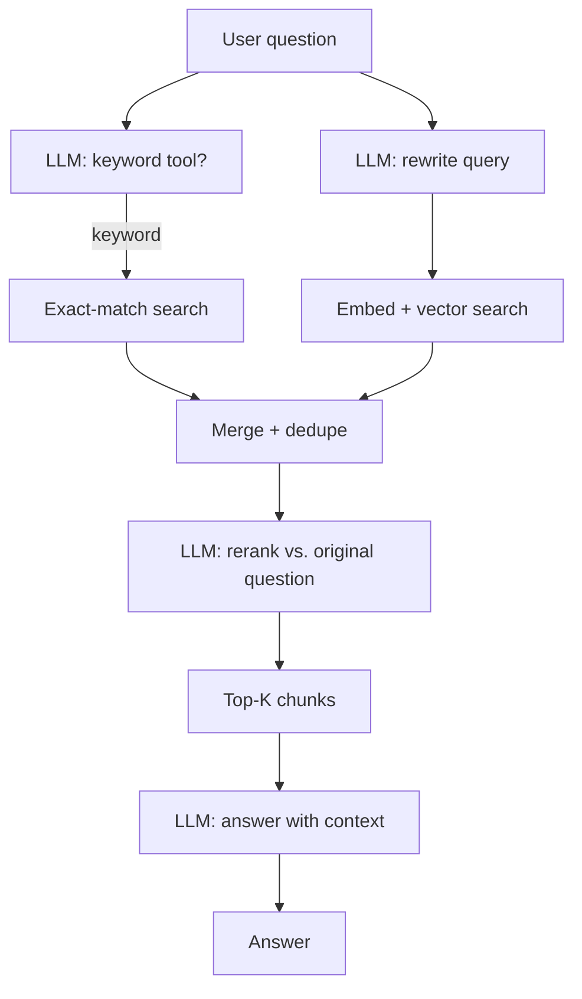
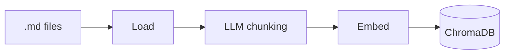

# Advanced RAG Pipeline

A retrieval-augmented generation pipeline over the Insurellm knowledge base, using
**hybrid retrieval**, **query rewriting**, and **LLM reranking**.

This module is built to utilize the Ollama model **ornith:9b**. With minor modifications
an OpenAI or Anthropic model can also be used.

## Approach

Naive RAG embeds the user's question, grabs the top-k nearest chunks, and stuffs them
into a prompt. That fails in three common ways, and each stage below exists to address
one of them.

### 1. Chunking is done by an LLM, not by character count

Fixed-size splitting cuts sentences in half and separates a fact from the heading that
gives it meaning. Instead, each document is handed to the LLM, which returns structured
chunks (`headline`, `summary`, `original_text`) with roughly 25% overlap. The text that
gets embedded is all three fields concatenated, so a chunk carries its own topic label
and summary into the vector space — a query that matches the *idea* of a chunk can find
it even when it shares no vocabulary with the raw text.

The target chunk count is derived from document length (`AVERAGE_CHUNK_SIZE`) and passed
to the model as a suggestion rather than a rule.

### 2. Retrieval is hybrid — vectors *and* exact keywords

Embeddings are good at meaning and bad at proper nouns. "Who went to Manchester
University?" is a semantic query about education, and pure vector search will happily
return chunks about universities in general while missing the one document that says
*Manchester*.

So two retrievers run and their results are combined:

- **Keyword search** — the LLM is offered a `find_documents_with_keyword` tool and
  decides for itself whether the question contains a distinctive term (a name, product,
  award, acronym, location) worth matching verbatim. If it does, it picks the keyword and
  a case-insensitive scan runs over the collection. For purely conceptual questions it
  declines to call the tool, and this path contributes nothing.
- **Vector search** — the question is first *rewritten* into a short, specific
  knowledge-base query, then embedded and matched against ChromaDB. Rewriting strips
  conversational filler and resolves references to the chat history, so what gets
  embedded is a clean retrieval query rather than a chat message.

Results are merged and deduplicated on `(source, page_content)`.

### 3. Reranking decides what actually reaches the context window

Merging two retrievers produces up to 25 candidates — too many to fit in a prompt, and
vector distance is a weak proxy for usefulness. A dedicated LLM call ranks all candidates
against the *original* question (not the rewritten one, which has lost nuance), and only
the top `ANSWER_CONTEXT_K` are passed to the answering model.

This is where the two-stage pattern pays off: retrieval can be generous and imprecise
because reranking is the filter.

## Pipeline



Indexing runs separately, and only when `REBUILD_DATABASE` is set:



## Module map

| File | Responsibility |
| --- | --- |
| `main.py` | Entry point. Optionally rebuilds the index, then asks a question. |
| `config.py` | All constants and shared clients. The only file with tunable values. |
| `models.py` | Pydantic schemas: `Result`, `Chunk`, `Chunks`, `RankOrder`. |
| `document_loader.py` | Walks the knowledge base and reads `.md` files into dicts. |
| `chunking.py` | LLM-driven chunking, plus JSON extraction and verbatim checking. |
| `embedding.py` | Embeds chunks and writes the ChromaDB collection. |
| `retrieval.py` | Keyword tool, vector search, query rewriting, merging, reranking. |
| `answer.py` | Orchestrates retrieval and generates the final grounded answer. |

Dependencies run one way — `main` → `answer` → `retrieval` → `config`/`models` — so there
are no import cycles.

### Why the prompts live where they do

There are three distinct system prompts, and each sits in the module that owns it:
`RERANK_SYSTEM_PROMPT` in `retrieval.py`, the answering prompt (`SYSTEM_PROMPT`, the one
with the `{context}` placeholder) in `answer.py`, and the tool-selection prompt inline in
`choose_retrieval_tool`. Keeping them apart matters: if the reranker's prompt is reachable
under the same name as the answering prompt, `.format(context=...)` silently returns it
unchanged — no error, and every retrieved chunk is dropped on the floor.

## Structured output

Every LLM call that must be machine-readable is constrained by a Pydantic schema passed
as `response_format` — `Chunks` for chunking, `RankOrder` for reranking. Local models
still wrap replies in ```` ```json ```` fences or `<think>` blocks, so `extract_json`
strips those, finds the first `{` or `[`, and uses `raw_decode` to ignore trailing junk.

Reranking is defensive for the same reason: the model can return ids that don't exist,
repeat one, or omit one. Out-of-range and duplicate ids are dropped, and any chunk the
model forgot is appended at the end, so the chunk count is always preserved.

## Running it

**Prerequisites**

- [Ollama](https://ollama.com) running on `localhost:11434`, with the model named in
  `config.py` available (`ollama list` to check).
- An `OPENAI_API_KEY` in `.env` at the repo root — generation is local, but embeddings
  use OpenAI's `text-embedding-3-large`.

**Run from the repository root**, since paths in `config.py` are relative to the working
directory:

```bash
python community-contributions/isg-hybrid-rag/main.py
```

To rebuild the index, set `REBUILD_DATABASE = True` in `config.py`. This re-chunks every
document through the LLM and is slow — leave it `False` for normal Q&A.

## Configuration

All in `config.py`:

| Setting | Default | Effect |
| --- | --- | --- |
| `MODEL` | `ollama_chat/ornith:9b` | Local model used for every generation step. |
| `EMBEDDING_MODEL` | `text-embedding-3-large` | Must match between indexing and querying. |
| `KNOWLEDGE_BASE_PATH` | `week05/knowledge-base` | Source documents, one subfolder per type. |
| `AVERAGE_CHUNK_SIZE` | `500` | Target chunk size, used to suggest a chunk count. |
| `VECTOR_RETRIEVAL_K` | `15` | Candidates from vector search. |
| `KEYWORD_RETRIEVAL_K` | `10` | Candidates from keyword search. |
| `ANSWER_CONTEXT_K` | `5` | Chunks that survive reranking and reach the prompt. |
| `REBUILD_DATABASE` | `False` | Re-chunk and re-embed before answering. |

## Notes

- `KNOWLEDGE_BASE_PATH` and `DB_NAME` are resolved against the current working directory,
  which is why the script must be run from the repo root. Anchoring them to
  `Path(__file__).parent` would remove that constraint.
- Changing `EMBEDDING_MODEL` requires a full rebuild; query and index vectors must come
  from the same model.
- `check_verbatim` in `chunking.py` verifies that the LLM returned original text rather
  than paraphrasing it. It is not wired into the pipeline — call it from
  `process_document` when tuning the chunking prompt.
