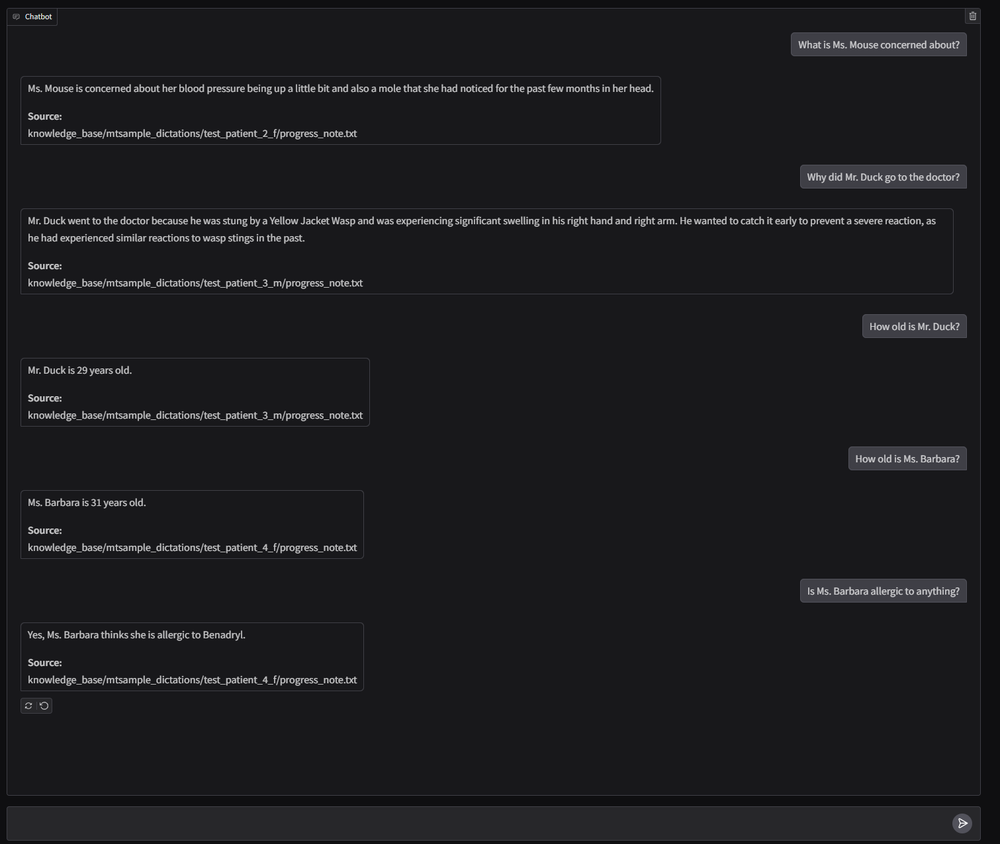

# Overview

This uses de-identified medical dictation data supplied by [mtsamples](https://mtsamples.com). The data from the mtsamples
website was download from [kaggle](https://www.kaggle.com/datasets/tboyle10/medicaltranscriptions). There are four 
sample notes in different directories (see knowledge_base/mtsamples_dictations) that will added to a chromaDb 
vector database and will be available during chat using RAG (Retrieval Augmented Generation).

# How to run

- Run example

```shell
conda activate <your_environment>
cd <your_directory_where_script_lives>
python run_rag_chat.py
```

# Chat example



# Questions to ask?

1) How old is Ms. Connor?
2) What are Ms. Connor's vital signs?
3) How old is Ms. Mouse?
4) What is Ms. Mouse concerned about?
5) What are Ms. Mouse's vital signs?
6) How old is Mr. Duck?
7) Why did Mr. Duck go to the doctor?
8) How old is Ms. Barbara? 
9) Why did Ms. Barbara go to the doctor?
10) Is Ms. Barbara allergic to anything?


