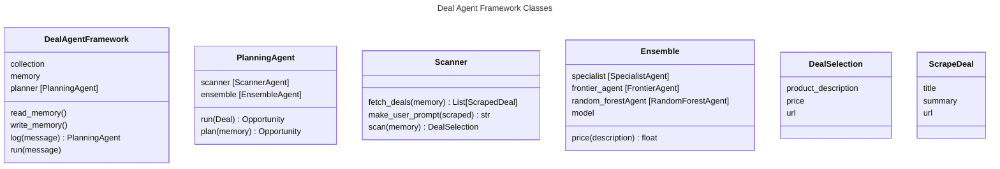
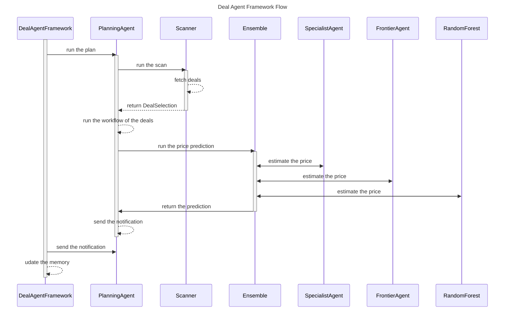

```mermaid
---
title: Deal Agent Framework Classes
---
classDiagram
    class DealAgentFramework{
    collection
    memory
    planner [PlanningAgent]
    read_memory()
    write_memory()
    log(message) PlanningAgent
    run(message)
    }
    class PlanningAgent{
    scanner [ScannerAgent]
    ensemble [EnsembleAgent]
    run(Deal) Opportunity
    plan(memory) Opportunity
    }
    class Scanner{
    fetch_deals(memory) List[ScrapedDeal]
    make_user_prompt(scraped) str
    scan(memory) DealSelection
    }
    class Ensemble{
    specialist [SpecialistAgent]
    frontier_agent [FrontierAgent]
    random_forestAgent [RandomForestAgent]
    model
    price(description) float
    }
    class DealSelection {
    product_description
    price
    url
    }
    class ScrapeDeal {
    title
    summary
    url
    }
```

```mermaid
---
title: Deal Agent Framework Flow
---
sequenceDiagram
    participant DealAgentFramework
    participant PlanningAgent
    participant Scanner
    participant Ensemble
    participant SpecialistAgent
    participant FrontierAgent
    participant RandomForest

    activate DealAgentFramework
    DealAgentFramework->>PlanningAgent: run the plan
    activate PlanningAgent
    PlanningAgent->>Scanner: run the scan
    activate Scanner
    Scanner-->>Scanner: fetch deals
    Scanner-->>PlanningAgent: return DealSelection
    deactivate Scanner
    PlanningAgent-->>PlanningAgent: run the workflow of the deals
    PlanningAgent->>Ensemble: run the price prediction
    activate Ensemble
    Ensemble<<->>SpecialistAgent: estimate the price
    Ensemble<<->>FrontierAgent: estimate the price
    Ensemble<<->>RandomForest: estimate the price
    Ensemble->>PlanningAgent: return the prediction
    deactivate Ensemble
    PlanningAgent-->>PlanningAgent: send the notification
    deactivate PlanningAgent
    DealAgentFramework->>PlanningAgent: send the notification
    DealAgentFramework-->>DealAgentFramework: udate the memory
    deactivate DealAgentFramework
```

